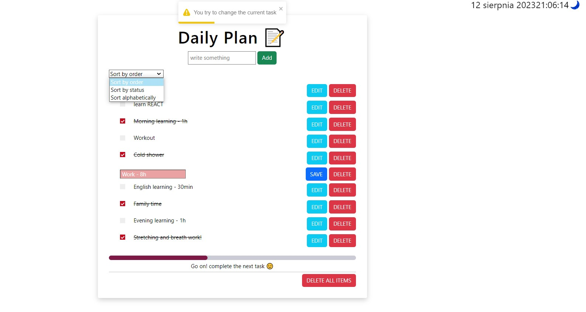

# Getting Started Daily Planner with Create React App

This project was bootstrapped with [Create React App](https://github.com/facebook/create-react-app).

## What is used in the project

- Context API
- useReducer, useEffect, useState
- useLocalStorageState hook
- function resetting at midnight each day and assigning initial fixed items
- CRUD operations
- sorted items
- progress bar
- fake dark/light mode :)
- imit Spinner works :)
- react toastify
- helpers function to better formatted date/time

## Available Scripts

In the project directory, you can run:

### `npm start`

Runs the app in the development mode.\
Open [http://localhost:3000](http://localhost:3000) to view it in your browser.

The page will reload when you make changes.\
You may also see any lint errors in the console.
